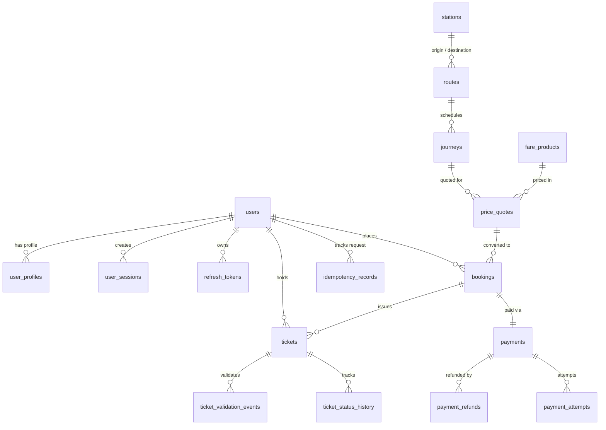

# SwiftTrack Database Entity-Relationship Diagram (ERD)

```mermaid
erDiagram
    users ||--o{ user_profiles : "has profile"
    users ||--o{ user_sessions : "creates"
    users ||--o{ refresh_tokens : "owns"
    users ||--o{ bookings : "places"
    users ||--o{ tickets : "holds"

    stations ||--o{ routes : "origin / destination"
    routes ||--o{ journeys : "schedules"
    journeys ||--o{ price_quotes : "quoted for"

    fare_products ||--o{ price_quotes : "priced in"
    price_quotes ||--o{ bookings : "converted to"

    bookings ||--|| payments : "paid via"
    payments ||--o{ payment_attempts : "attempts"
    payments ||--o{ payment_refunds : "refunded by"

    bookings ||--o{ tickets : "issues"
    tickets ||--o{ ticket_status_history : "tracks"
    tickets ||--o{ ticket_validation_events : "validates"

    users ||--o{ idempotency_records : "tracks request"
```
