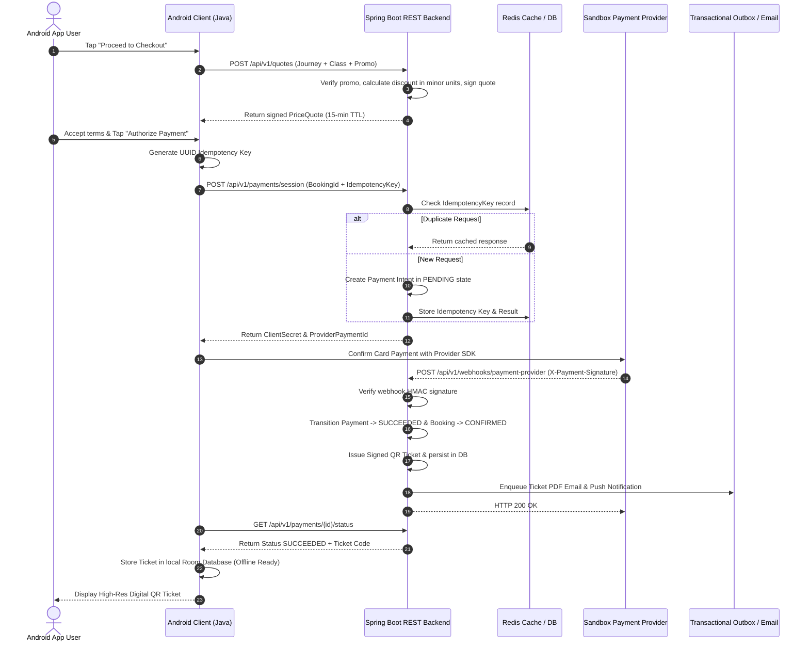

# SwiftTrack Payment & Webhook Sequence Diagram

```mermaid
sequenceDiagram
    autonumber
    actor Customer as Android App User
    participant App as Android Client (Java)
    participant Backend as Spring Boot REST Backend
    participant Redis as Redis Cache / DB
    participant Gateway as Sandbox Payment Provider
    participant Outbox as Transactional Outbox / Email

    Customer->>App: Tap "Proceed to Checkout"
    App->>Backend: POST /api/v1/quotes (Journey + Class + Promo)
    Backend->>Backend: Verify promo, calculate discount in minor units, sign quote
    Backend-->>App: Return signed PriceQuote (15-min TTL)

    Customer->>App: Accept terms & Tap "Authorize Payment"
    App->>App: Generate UUID Idempotency Key
    App->>Backend: POST /api/v1/payments/session (BookingId + IdempotencyKey)
    Backend->>Redis: Check IdempotencyKey record
    alt Duplicate Request
        Redis-->>Backend: Return cached response
    else New Request
        Backend->>Backend: Create Payment Intent in PENDING state
        Backend->>Redis: Store Idempotency Key & Result
    end
    Backend-->>App: Return ClientSecret & ProviderPaymentId

    App->>Gateway: Confirm Card Payment with Provider SDK
    Gateway-->>Backend: POST /api/v1/webhooks/payment-provider (X-Payment-Signature)
    Backend->>Backend: Verify webhook HMAC signature
    Backend->>Backend: Transition Payment -> SUCCEEDED & Booking -> CONFIRMED
    Backend->>Backend: Issue Signed QR Ticket & persist in DB
    Backend->>Outbox: Enqueue Ticket PDF Email & Push Notification
    Backend-->>Gateway: HTTP 200 OK

    App->>Backend: GET /api/v1/payments/{id}/status
    Backend-->>App: Return Status SUCCEEDED + Ticket Code
    App->>App: Store Ticket in local Room Database (Offline Ready)
    App-->>Customer: Display High-Res Digital QR Ticket
```
